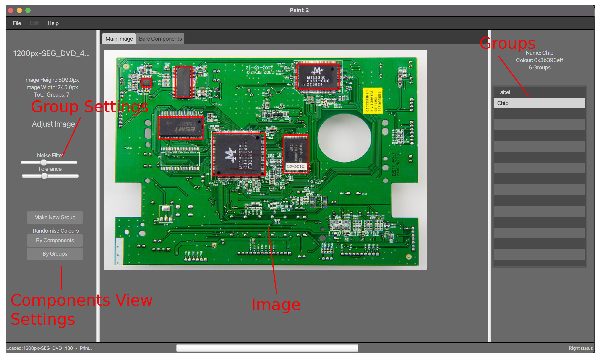
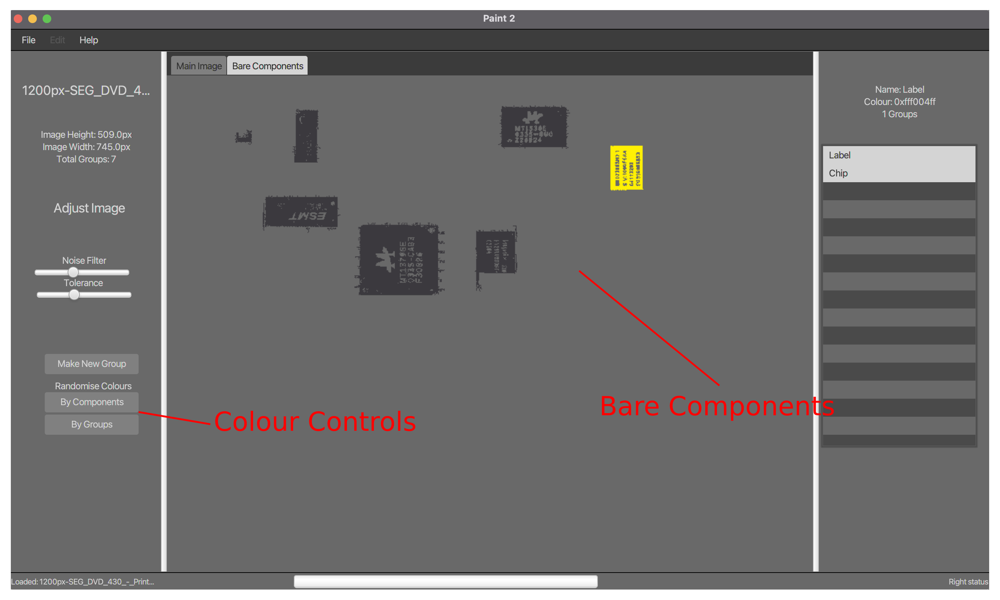

# PCB Analyser
This is a javafx project that analyses PCBs by grouping together components of similiar colour, basically the magic wand tool in photoshop but for PCBs. The project was developed as part of CA 1 for Data Structures and Algorithms module in 2nd year of Applied Computing in WIT.

## Instructions

- Add image of PCB (or whatever) to the app by clicking file>open.
- Select a component by clicking on it.
- Click create new group, and input a name.
- This adds the selected component to the group. when the component is selected, it will be highlighted in the image.
- Select the component and adjust the threshold and noise filter to fine tune the selection.
- Repeat the process for all components.
- View components by selecting them in the right hand list.
- Can be viewed either by drawing boxes or raw pixels.

## Notes

- This uses CoolLinkedList, a custom linked list implementation. Developed for previous assignment.
- Grouping is handled by a pixel by per pixel comparison of the image.
- The image is converted to a 2D array of pixels, and each pixel is compared to the selected pixel.
- If the pixel is within the threshold, it is added to the group.
- The noise filter is used to remove small groups of pixels that are not part of the component.
- The image is then updated to show the selected group.

## Annotated GUI

### Image View

### Component View

## Authors

- Cian Farrell

**Note:** *Please do not plagiarise this work. This repo exists for archival purposes only.*
